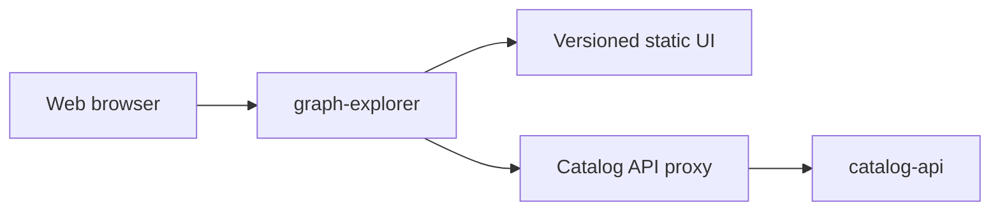

# GrooveMap Graph Explorer

The public-facing graph exploration application for GrooveMap. It serves a static Tailwind/Alpine/D3/Plotly interface and proxies browser requests to the separately deployed `catalog-api`, including streamed natural-language query responses.



This project is licensed under the [GNU Affero General Public License v3.0 only](LICENSE). Commercial use is permitted under the AGPL when its terms are followed; [alternative commercial terms may be negotiated](COMMERCIAL-LICENSING.md).

External contributions are temporarily paused until a relicensing-capable contributor agreement is approved. See [CONTRIBUTING.md](CONTRIBUTING.md) before proposing changes.

## Development

Prerequisites are pinned in `.mise.toml`. Python and JavaScript dependencies are committed in `uv.lock` and `explore/package-lock.json`.

```bash
mise install
just setup
just check
```

The repository interface is:

- `just setup` — install locked Python and Node environments.
- `just check` — run the authoritative pre-merge gate.
- `just test` / `just js-test` — run Python proxy and JavaScript unit suites.
- `just e2e-setup` / `just e2e` — install and run the Chromium, Firefox, WebKit, iPhone, and iPad browser matrix against the self-contained mock Catalog API, retaining coverage and failure artifacts.
- `just build` — generate CSS and build the wheel/source distribution.
- `just image` — build and inspect the non-root production image.
- `just release-dry-run` — generate checksums, SBOM, notices, and provenance without publishing.
- `just bump-preview` — preview the Conventional Commits version/changelog without changing files.

## Runtime

```bash
API_BASE_URL=http://localhost:8004 uv run graph-explorer
```

The application listens on `8006` and its process health server on `8007`. `CORS_ORIGINS` accepts a comma-separated allowlist. Authentication and all catalog data remain owned by `catalog-api`.

## Repository boundary

`contracts/catalog-api/graph-explorer/v1/` is an immutable promoted copy of the producer-owned method/path contract. `scripts/check-contracts.py` verifies its digest and every `/api/*` route referenced by browser JavaScript. No Catalog API source is imported or required in the image build context.

The first-party `groovemap-runtime` dependency is resolved from the public
[`groovemap-music/python-libraries`](https://github.com/groovemap-music/python-libraries)
repository at the full commit pinned in both `pyproject.toml` and `uv.lock`.
`scripts/prepare-runtime-wheel.sh` converts that reviewed source into a local
wheel before the isolated image build; the Docker build never fetches source or
depends on another repository's build context.

Canonical editable branding belongs to the public [`groovemap-music/design`](https://github.com/groovemap-music/design) repository. `explore/static/brand/` contains byte-identical deterministic render outputs promoted from the full design commit recorded in [`source.json`](explore/static/brand/source.json); [`scripts/promote-brand.sh`](scripts/promote-brand.sh) refuses any other source revision or a dirty source tree. The old monorepo raster copies are deliberately not retained. Use of the GrooveMap name and logos is governed separately by the design repository's [trademark-use policy](https://github.com/groovemap-music/design/blob/main/TRADEMARKS.md).

## Releases

This independently deployable application is versioned from PEP 621 metadata using Commitizen and annotated `v$version` tags. Migration verification does not publish images, packages, tags, or releases. The active release workflow runs only when an explicitly approved `v*` tag is pushed; it then validates the release candidate and publishes the repository-named image to GHCR.

See the [documentation index](docs/README.md) for the architecture, release boundary, public
decisions, and source-history sanitization gate.
