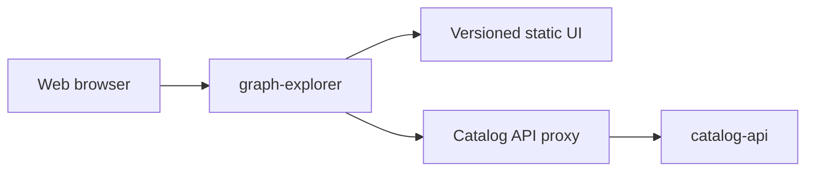

# GrooveMap Graph Explorer

The public-facing graph exploration application for GrooveMap. It serves a static Tailwind/Alpine/D3/Plotly interface and proxies browser requests to the separately deployed `catalog-api`, including streamed natural-language query responses.



This project is licensed under the [GNU Affero General Public License v3.0 only](LICENSE). Commercial use is permitted under the AGPL when its terms are followed; [alternative commercial terms may be negotiated](COMMERCIAL-LICENSING.md).

External contributions are temporarily paused until a relicensing-capable contributor agreement is approved. See [CONTRIBUTING.md](CONTRIBUTING.md) before proposing changes.

## Development

Prerequisites are pinned in `.mise.toml`. Python and JavaScript dependencies are committed in `uv.lock` and `explore/package-lock.json`.

```bash
mise install
just setup
just check
```

The repository interface is:

- `just setup` — install locked Python and Node environments.
- `just check` — run the authoritative pre-merge gate.
- `just test` / `just js-test` — run Python proxy and JavaScript unit suites.
- `just e2e-setup` / `just e2e` — install and run the Chromium, Firefox, WebKit, iPhone, and iPad browser matrix against the self-contained mock Catalog API, retaining coverage and failure artifacts.
- `just build` — generate CSS and build the wheel/source distribution.
- `just image` — build and inspect the non-root production image.
- `just release-dry-run` — generate checksums, SBOM, notices, and provenance without publishing.
- `just bump-preview` — preview the Conventional Commits version/changelog without changing files.

## Runtime

```bash
API_BASE_URL=http://localhost:8004 uv run graph-explorer
```

The application listens on `8006` and its process health server on `8007`. `CORS_ORIGINS` accepts a comma-separated allowlist. Authentication and all catalog data remain owned by `catalog-api`.

### OpenTelemetry

graph-explorer emits metrics and traces through `groovemap-runtime`'s `common.telemetry` module. Both signals are pushed over OTLP HTTP/protobuf to the same collector and are independent: either can be turned off without affecting the other. Telemetry is entirely optional — with no endpoint configured, or without the `otel`/`otel-http` extras installed, the service starts and behaves exactly as it does with telemetry disabled, and `shutdown_telemetry()` flushes both providers on exit.

#### Metrics

| Metric | Kind, unit | Attributes |
| --- | --- | --- |
| `http.server.request.duration` | histogram, seconds | `http.route` (templated, e.g. `/api/{path:path}`, never a raw path), `http.response.status_code` |
| `http.client.request.duration` | histogram, seconds | `server.address` (`catalog-api`), `http.response.status_code` |
| `groovemap.explore.proxy.duration` | histogram, seconds | `http.route`, `outcome` (`success`, `timeout`, `upstream_error`) |

`groovemap.explore.proxy.duration` is this service's own domain metric. Unlike the outbound HTTP metric — which, because the proxy sends with `stream=True`, only covers the wait for response headers — it always covers the full duration of a proxied request, including a complete Server-Sent-Events stream.

#### Runtime metrics

`setup_telemetry()` installs the process view with no code in this repository: `process.cpu.time`, `process.cpu.utilization`, `process.memory.usage`, `process.memory.virtual`, `process.thread.count`, `process.open_file_descriptor.count`, `process.context_switches`, and `cpython.gc.collections`. No `system.*` host metric is collected; a host is scraped once by node-exporter.

The FastAPI lifespan additionally starts `start_event_loop_monitor()`, which samples this loop's scheduling delay into `groovemap.runtime.event_loop.lag` (histogram, seconds, no attributes) once a second. The proxy is I/O-bound, so loop lag is the signal that separates a slow `catalog-api` from a graph-explorer worker that cannot get scheduled. The monitor declines to sample when metrics are not being exported and is cancelled by `shutdown_telemetry()`.

#### Traces

| Span | Name | Kind |
| --- | --- | --- |
| Inbound request | `GET /api/{path:path}` and the other route templates, from the FastAPI instrumentation | `SERVER` |
| Outbound proxy call to `catalog-api` | from the httpx instrumentation | `CLIENT` |

There is no domain span: the service is a proxy, and both spans it produces come from the HTTP instrumentors. The `CLIENT` span is a child of the `SERVER` span, and the proxy client writes `traceparent` onto the outbound request, so a browser request and the `catalog-api` request it triggers appear as one trace. Span names stay low-cardinality because the route is templated; no id, path, query, or free text is ever a span attribute.

#### Configuration

Only standard OpenTelemetry environment variables are read; there is no GrooveMap-specific telemetry configuration:

| Variable | Meaning | Default |
| --- | --- | --- |
| `OTEL_EXPORTER_OTLP_ENDPOINT` | Collector base URL, e.g. `http://otel-collector:4318`. Unset disables export. | unset |
| `OTEL_EXPORTER_OTLP_METRICS_ENDPOINT` | Metrics-only endpoint override | falls back to `OTEL_EXPORTER_OTLP_ENDPOINT` |
| `OTEL_EXPORTER_OTLP_TRACES_ENDPOINT` | Traces-only endpoint override | falls back to `OTEL_EXPORTER_OTLP_ENDPOINT` |
| `OTEL_METRICS_EXPORTER` | `otlp` or `none` | `otlp` |
| `OTEL_TRACES_EXPORTER` | `otlp` or `none` | `otlp` |
| `OTEL_TRACES_SAMPLER` | Sampler name the SDK understands | `parentbased_traceidratio` |
| `OTEL_TRACES_SAMPLER_ARG` | Sampling ratio for the ratio samplers | `1.0` |
| `OTEL_SDK_DISABLED` | `true` makes the SDK itself a no-op | `false` |
| `OTEL_METRIC_EXPORT_INTERVAL` | Push interval in milliseconds | SDK default |
| `OTEL_SERVICE_NAME` | `service.name`, overriding the `explore` default | `explore` |
| `OTEL_RESOURCE_ATTRIBUTES` | Extra resource attributes, e.g. `service.namespace=groovemap,deployment.environment.name=dev` | empty |

## Media filters

Physical and digital media are filtered by the canonical GrooveMap taxonomy rather than by raw provider format strings. `GET /api/collection/media` supplies the families present in a collection and the mediums under each one, which the gap-analysis pane renders as a multi-select grouped by family: selecting a family covers every medium in it, and an individual medium narrows further. Selections travel to the gap endpoints as repeated `media` parameters, superseding the deprecated `formats` alias.

A release row shows its media as badges grouped by family, each naming the family, the medium, and the quantity when more than one — `Vinyl · 12" vinyl ×2`. Rows that carry no media block still fall back to the provider's raw format strings. Search exposes the same families as a `media` facet with counts; clicking a facet chip filters the query by that family.

## Repository boundary

`contracts/catalog-api/graph-explorer/v1/` is an immutable promoted copy of the producer-owned method/path contract. `scripts/check-contracts.py` verifies its digest and every `/api/*` route referenced by browser JavaScript. No Catalog API source is imported or required in the image build context.

The first-party `groovemap-runtime` dependency is resolved from the public
[`groovemap-music/python-libraries`](https://github.com/groovemap-music/python-libraries)
repository at the full commit pinned in both `pyproject.toml` and `uv.lock`.
`scripts/prepare-runtime-wheel.sh` converts that reviewed source into a local
wheel before the isolated image build; the Docker build never fetches source or
depends on another repository's build context.

Canonical editable branding belongs to the public [`groovemap-music/design`](https://github.com/groovemap-music/design) repository. `explore/static/brand/` contains byte-identical deterministic render outputs promoted from the full design commit recorded in [`source.json`](explore/static/brand/source.json); [`scripts/promote-brand.sh`](scripts/promote-brand.sh) refuses any other source revision or a dirty source tree. The old monorepo raster copies are deliberately not retained. Use of the GrooveMap name and logos is governed separately by the design repository's [trademark-use policy](https://github.com/groovemap-music/design/blob/main/TRADEMARKS.md).

## Releases

This independently deployable application is versioned from PEP 621 metadata using Commitizen and annotated `v$version` tags. Migration verification does not publish images, packages, tags, or releases. The active release workflow runs only when an explicitly approved `v*` tag is pushed; it then validates the release candidate and publishes the repository-named image to GHCR.

See the [documentation index](docs/README.md) for the architecture, release boundary, public
decisions, and source-history sanitization gate.
