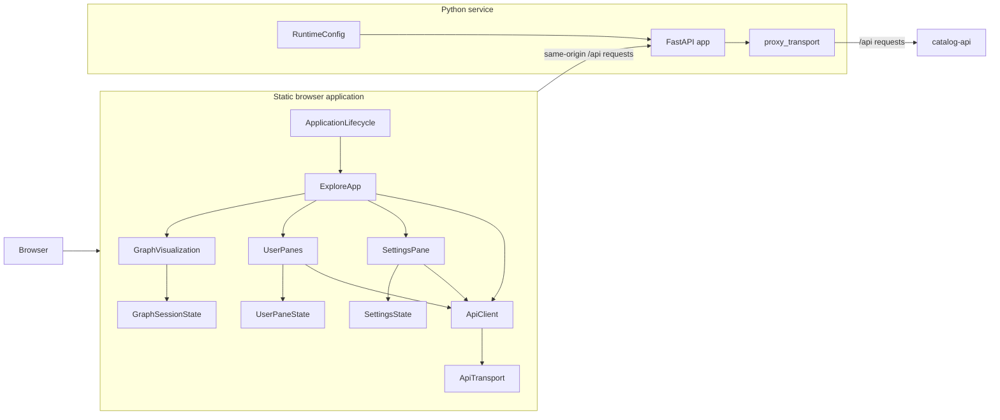

# Architecture

`graph-explorer` owns the public browser application and the narrow HTTP proxy that carries its
requests to `catalog-api`. It does not own catalog persistence, ingestion, analytics computation,
deployment topology, or editable brand sources.

## Boundaries

- `explore/static/` is the deployed UI. Its vendor and brand trees are deterministic artifacts
  with checked source and license manifests.
- `explore/explore.py` is the composition root and owns health, process lifecycle, static serving,
  and the `/api/{path:path}` proxy entry point. `runtime_config.py` constructs immutable startup
  settings, while `proxy_transport.py` owns request, timeout, and response-header policy. Only
  `nlq/query` disables the upstream body read timeout; its response-header phase remains bounded.
- `ApplicationLifecycle` owns browser startup and teardown. The graph, personal-pane, and settings
  controllers delegate their mutable state to `GraphSessionState`, `UserPaneState`, and
  `SettingsState`; `ApiClient` delegates fetch/session mechanics to `ApiTransport`.
- `contracts/catalog-api/graph-explorer/v1/` is a promoted producer contract. Validation ensures
  every browser API route remains represented without importing another repository's source.
- The image and wheel are built entirely from this repository plus the exact reviewed
  `python-libraries` commit prepared as a wheel before the isolated image build.

Catalogue identifiers are owned upstream under
[ADR 0011](https://github.com/groovemap-music/design/blob/main/docs/adr/0011-catalog-identifiers-and-manufacturing-credits.md).
The browser sends a barcode, catalogue number, or matrix inscription to `/api/lookup` exactly as
the collector typed it and renders what comes back; which namespaces are addressable and how each
normalizes its value are decided by `catalog-api`, and nothing about that normalization is
reimplemented here. The identifier type labels in `explore/static/js/app.js` are presentation
only, and a type the map has no word for is rendered as the producer named it. Release country is
matched by the producer exactly as the catalog stores it, so the country chips send back the
string they were given.

The media taxonomy is likewise owned upstream. `catalog-api` classifies every release into
canonical media families and mediums, and the browser only renders what the collection media
endpoint and each release's `media` block report — the family label map in
`explore/static/js/media-taxonomy.js` is presentation only, and an unrecognized id falls back to
a humanized form rather than being dropped.

Authentication and catalog authorization remain `catalog-api` responsibilities. The browser
stores the issued token and sends it through the proxy, but `graph-explorer` does not mint or
interpret that token.

Activity events, consent, and erasure are owned upstream the same way. The browser posts an
outcome against the `impression_id` the API issued and renders the consent, export, and erasure
surfaces, but what is durably written, whether consent permits it, and what an erasure removes
are all decided by `catalog-api` under
[ADR 0010](https://github.com/groovemap-music/design/blob/main/docs/adr/0010-first-party-events-consent-and-deletion.md).
Outcome posts are fire-and-forget and never gate an interaction — see
[Activity events and account data controls](activity-and-account-data.md).

## Promoted and pinned authorities

| Authority | Revision | Local evidence |
| --- | --- | --- |
| `catalog-api` graph-explorer route contract | `ec2db559e2a457dcac2acaa845adee62d4bfa5a2` | [`contracts/catalog-api/graph-explorer/v1/source.json`](../contracts/catalog-api/graph-explorer/v1/source.json) and [`routes.json`](../contracts/catalog-api/graph-explorer/v1/routes.json) |
| `python-libraries` runtime package | `455523ec388fdb9862d7aca65d9434aa7073dcb5` | [`pyproject.toml`](../pyproject.toml) and `uv.lock` |
| `design` generated brand assets | `59c9fd3c8bbdfa676e0b7bb3d463fc766c1f3c0d` | [`explore/static/brand/source.json`](../explore/static/brand/source.json) |

`scripts/check-contracts.py` verifies the producer digest and checks every literal browser API
route against the promoted route set. A registry entry may carry a `parameters` list beside its
method and path, naming query parameters the producer promised this consumer; the checker
validates the entry's shape and rejects a key it does not understand, so a producer field nobody
here reads is a loud failure rather than an unverified promise. `scripts/check-brand.py` verifies
the source revision and every asset digest. Editable brand sources are never copied here: [`scripts/promote-brand.sh`](../scripts/promote-brand.sh)
accepts only a clean design checkout at the pinned revision and runs the producer renderer in
check mode before replacing the generated asset tree.
