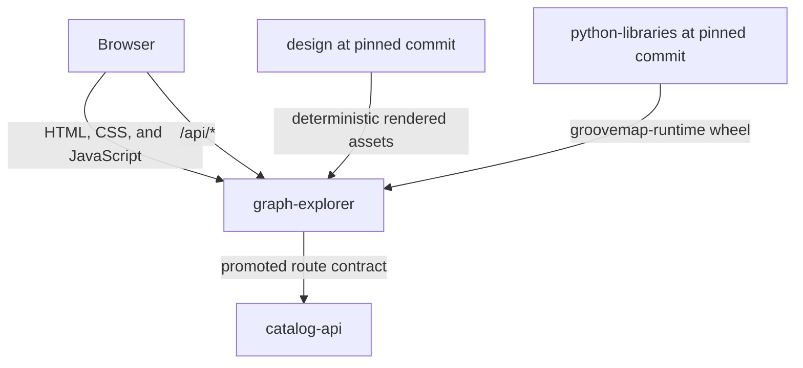

# Architecture

`graph-explorer` owns the public browser application and the narrow HTTP proxy that carries its
requests to `catalog-api`. It does not own catalog persistence, ingestion, analytics computation,
deployment topology, or editable brand sources.

## Boundaries

- `explore/static/` is the deployed UI. Its vendor and brand trees are deterministic artifacts
  with checked source and license manifests.
- `explore/explore.py` owns health, lifecycle, static serving, and the API proxy. Only the
  allowlisted server-sent-event route disables the upstream read timeout.
- `contracts/catalog-api/graph-explorer/v1/` is a promoted producer contract. Validation ensures
  every browser API route remains represented without importing another repository's source.
- The image and wheel are built entirely from this repository plus the exact reviewed
  `python-libraries` commit prepared as a wheel before the isolated image build.

The media taxonomy is likewise owned upstream. `catalog-api` classifies every release into
canonical media families and mediums, and the browser only renders what the collection media
endpoint and each release's `media` block report — the family label map in
`explore/static/js/media-taxonomy.js` is presentation only, and an unrecognized id falls back to
a humanized form rather than being dropped.

Authentication and catalog authorization remain `catalog-api` responsibilities. The browser
stores the issued token and sends it through the proxy, but `graph-explorer` does not mint or
interpret that token.
