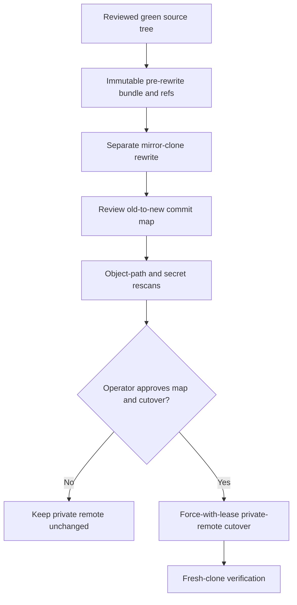

# History rewrite approval gate

This procedure is prepared evidence, not authorization. It runs only after current source and
documentation changes are archived, reviewed, and merged. It operates in a new mirror clone; the
working repository and its remotes are never rewritten in place.

## Scope

The rewrite removes raw private planning paths from every reachable commit:

- `.planning/`
- `docs/superpowers/plans/`
- `docs/superpowers/specs/`
- `docs/extraction.md`

The public conclusions that replace them are in [architecture decisions](architecture-decisions.md),
[architecture](architecture.md), and [release compliance](release-compliance.md).



Before any rewrite, record the private remote URL, every ref and peeled object ID, default branch,
visibility, branch protection, and release/tag inventory. Create and independently verify a full
Git bundle. Store the bundle, manifests, maps, checksums, and logs outside every repository and
synchronized workspace with directories at mode `0700` and files at mode `0600`.

Retain the archive through cutover and rollback and until the later of 90 days after cutover or
30 days after the repository becomes public. Deletion requires separate operator approval after
that retention deadline.

The checked-in rehearsal runs only on local clones:

```bash
export PLANNING_ARCHIVE_REPO=/absolute/path/to/planning-archive
just history-rehearsal /absolute/path/to/graph-explorer /absolute/new/evidence-directory
```

It requires the private archive prerequisite, creates independent backup and sanitized mirrors,
records input and output refs plus the old-to-new commit map, verifies the Git object graph, scans
the complete reachable history and a fresh worktree for secrets, and records both approval flags
as `false`.

## Separate cutover approval

No push follows automatically. The operator must explicitly approve the reviewed map, exact
private remote, expected force-with-lease values, maintenance window, rollback owner, and backup
retention. Repository visibility remains unchanged. Tags, releases, and packages are not created
or deleted. Any remote drift invalidates the evidence and requires a new rehearsal.
