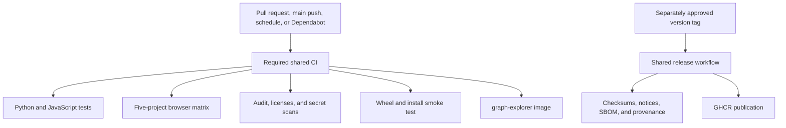

# Release compliance

No migration or validation command publishes a package, image, tag, release, deployment, or
repository setting. Publication requires an approved annotated version tag and the separately
controlled hosted release workflow.

## Local gates

- `just check` composes the lockfile-backed Ruff checks, contracts, brand and repository policy,
  the narrow `secret-scan` recipe, type checks, Python and JavaScript tests, deterministic web
  assets, wheel/vendor evidence, installed-wheel smoke tests, dependency-license policy, release
  artifacts, and the non-mutating version preview. A private Node prerequisite performs one
  locked install when JavaScript tests and the web build run in the same invocation.
- `just coverage` writes `coverage.xml` and `explore/coverage/lcov.info` without rebuilding web
  assets. `just build` generates the vendor tree and CSS once, validates its notices, and builds
  the wheel and source distribution; `just artifact-check` verifies that the wheel contains the
  exact vendor, brand, and first-party legal evidence. The release-evidence stage reuses those
  validated distributions instead of rebuilding the same packages inside `just check`.
- `just audit` checks the locked Python and JavaScript environments for known vulnerabilities.
- `just image` builds and inspects the repository-named non-root image with its exact source
  revision, license, repository, legal files, third-party notices, and brand provenance.
- `just e2e` instruments browser JavaScript, runs Chromium, Firefox, WebKit, iPhone, and iPad,
  emits per-project and merged LCOV, captures failure artifacts, and restores every source file.
- `just release-dry-run` creates the wheel, source archive, checksums, notices, SBOM, and
  provenance locally. It does not commit, tag, push, publish, or create a release.

## Automation

The thin CI and release callers pin `groovemap-music/automation` at
`833cb464507678c38ab78bd4718ce697399463e9`. CI runs for pushes to `main`, ordinary and
Dependabot-authored pull requests, manual dispatches, and two weekly full/security schedules.
Every pull request uses one required job graph; there is no actor-specific skip or reduced
fallback. Hosted browser work remains split across `e2e-setup`, `e2e-instrument`, `e2e-run`, and
`e2e-post`, preserving system setup, per-project results, failure artifacts, coverage finalization,
and source restoration as distinct reusable-workflow capabilities.

Complete validation needs read access to the pinned `python-libraries` revision.
`GROOVEMAP_CI_APP_CLIENT_ID` and `GROOVEMAP_CI_APP_PRIVATE_KEY` supply that read-only checkout.
`CODECOV_TOKEN` is mapped explicitly and uploads fail closed. Infrastructure provides the same
credential names to ordinary Actions and Dependabot.

## Historical planning privacy

Raw migration plans are preserved in private `planning-archive`, removed from the current tree,
and rehearsed for removal from every reachable historical object. The filtered clone is the only
permissible rewrite target. Replacing the private remote from that clone and making the repository
public are separate operator-approved actions; neither is performed by repository validation.
